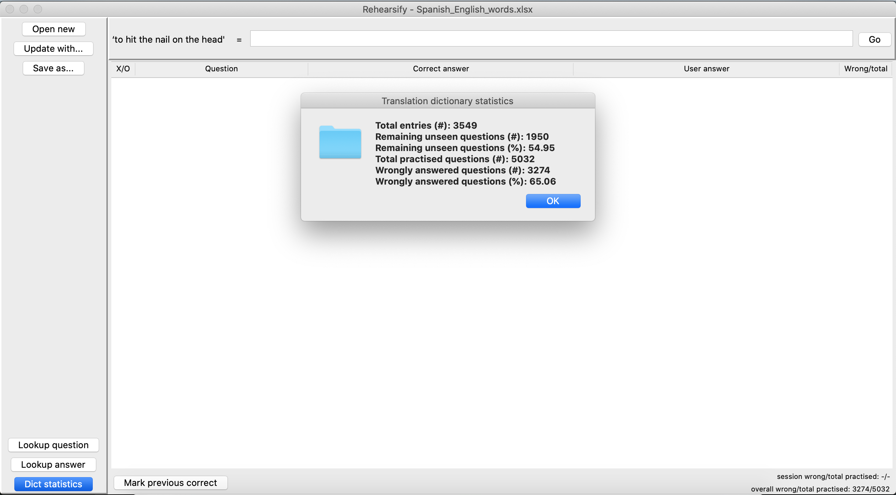
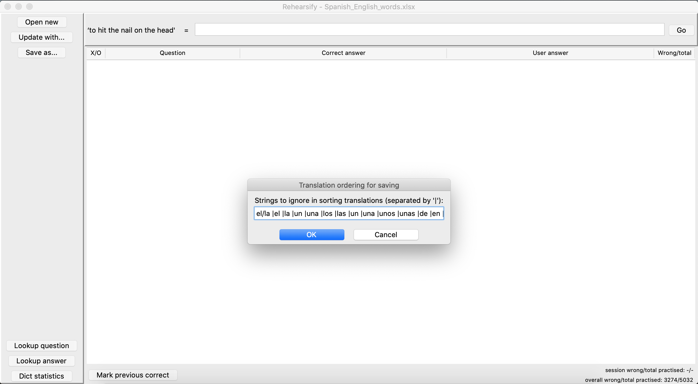
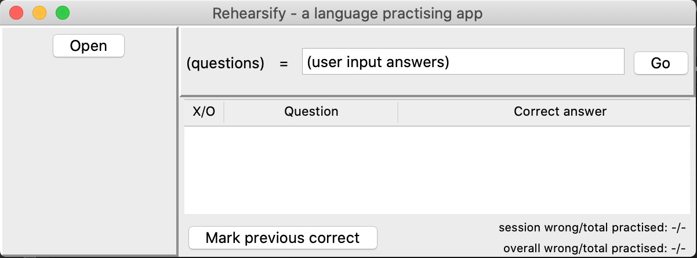
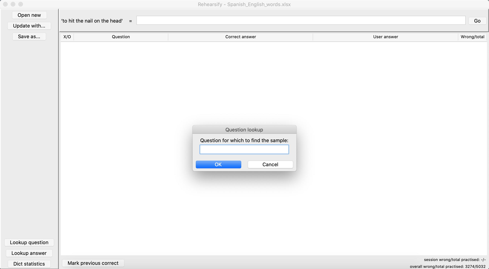
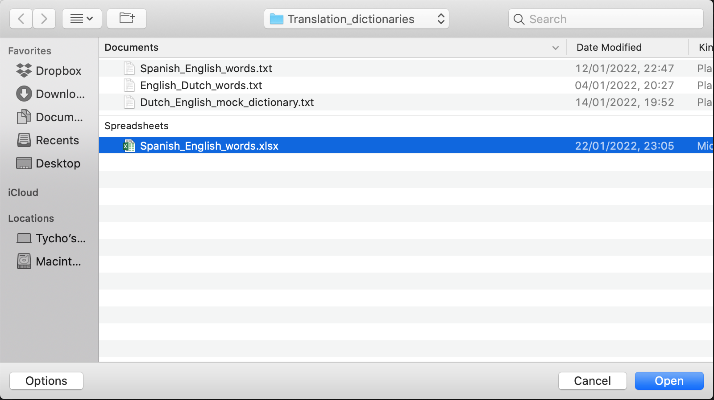
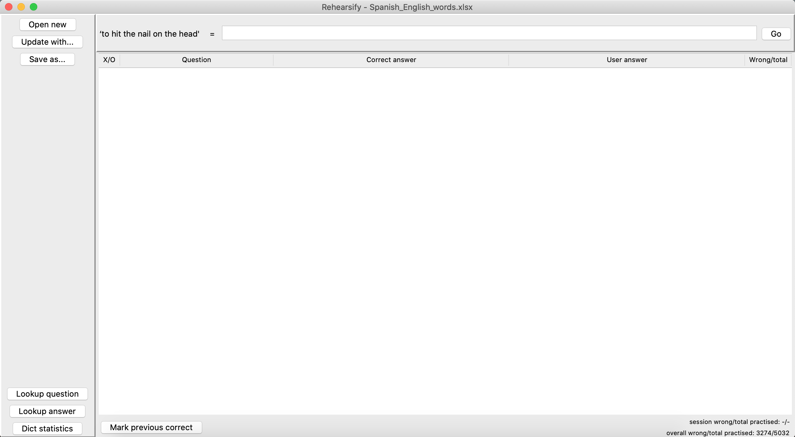
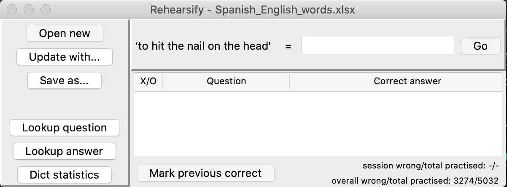
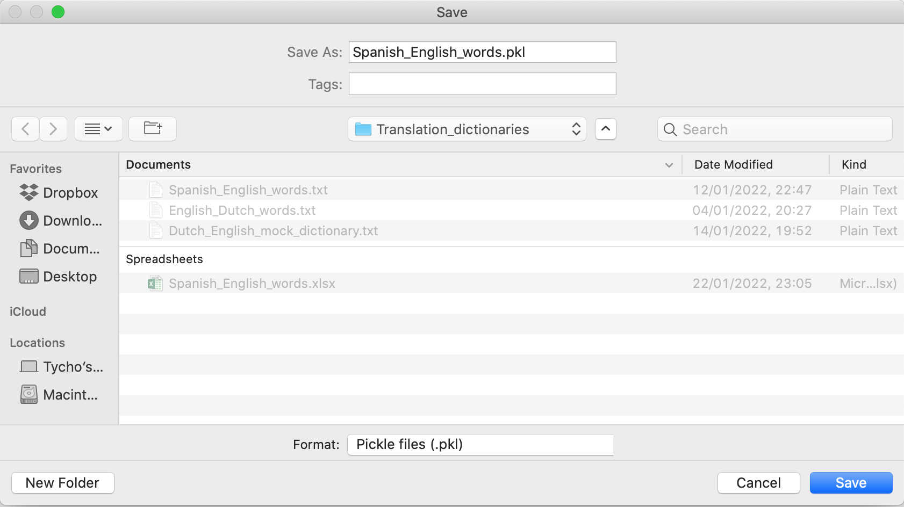

# Rehearsify - an app for practising foreign language words

## Overview

Rehearsify is an app for practising foreign language words. To get started, these can be loaded in from a simple .txt file. This allows the user great flexibility in the question they want to practise and the corresponding answers that will be counted as correct. Access is provided through a simple, intuitive GUI, from which progress scores might be saved. Further offered functionality includes the option to look up a question for the appropriate answer or vice versa, and to inspect some statistics of the the loaded dictionary of translations.

## Usage

- Open GUI by calling `python3 main.py` from the command line
- Open file
- file should look like ... + screen shot(s)
- rehearse words
- correct answer will show up in log, statistics will be updated + screen shot
- maximise screen to see how given user answer contrasts, and the statistics for the translation in question

- save as -> file formats
- ordering string + screen shot
- update with -> use more actual .txt to add new translations and remove those not .txt

- lookup buttons + screen shot
- dict statistics button + screen shot

- other command line functionality

```bash
python3 FindDuplicates translation_dictionary_fpath
python3 Statistics translation_dictionary_fpath
```







)


## TO-DO

- [x] write tests
- [ ] write README.md
- [ ] Make Github Project public
- [ ] Add delight to the experience when all tasks are complete :tada:

<!-- comments -->
