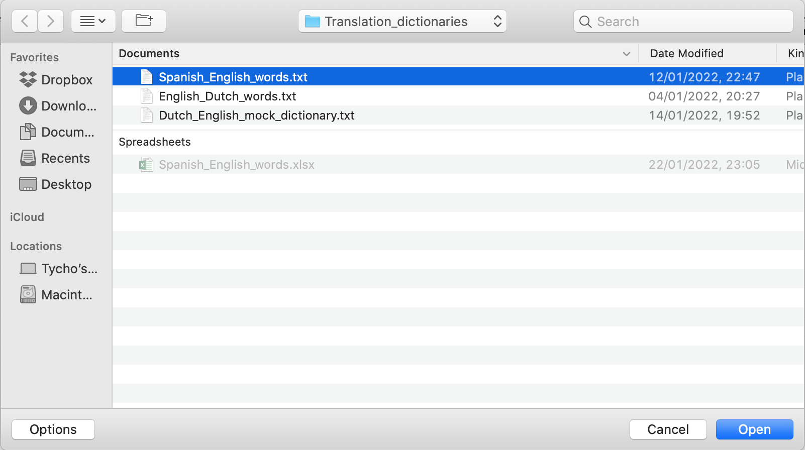

# Rehearsify - a tool for rehearsing foreign language words

## Overview

- reasons for writing project

## Usage

- Open GUI by calling `python3 main.py` from the command line
- Open file
- file should look like ... + screen shot(s)
- rehearse words
- correct answer will show up in log, statistics will be updated + screen shot
- maximise screen to see how given user answer contrasts, and the statistics for the translation in question

- save as -> file formats
- ordering string + screen shot
- update with -> use more actual .txt to add new translations and remove those not .txt

- lookup buttons + screen shot
- dict statistics button + screen shot

- other command line functionality

```bash
python3 FindDuplicates translation_dictionary_fpath
python3 Statistics translation_dictionary_fpath
```

## TO-DO

- [x] write tests
- [ ] write README.md
- [ ] Make Github Project public
- [ ] Add ML sample selector
- [ ] Add delight to the experience when all tasks are complete :tada:

<!-- This content will not appear in the rendered Markdown 

**bold**
_italic_
~~strikethrough~~

A quote is given as:
> quote


)



links: This site was built using [GitHub Pages](https://pages.github.com/).

unordered list:

- item1
- item2
- item3

ordered list:

1 item1
2 item2
3 item3

-->
