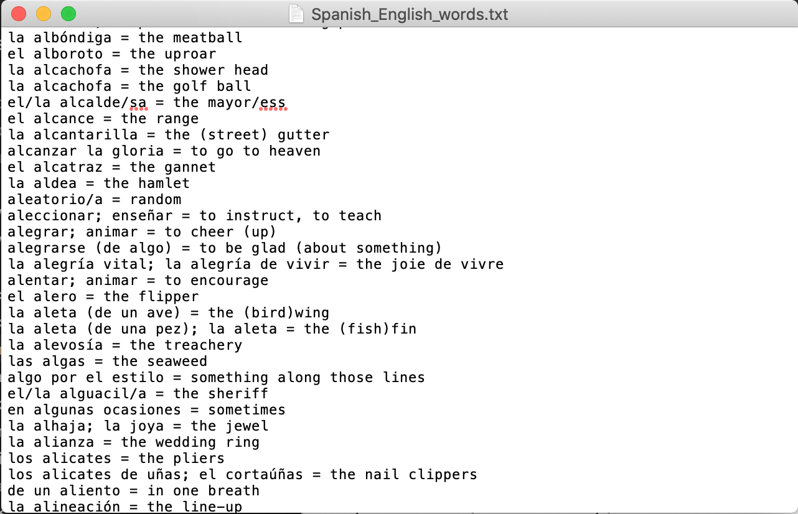

# Rehearsify - an app for practising foreign language words

## Overview

Rehearsify is an app for practising foreign language words. To get started, these can be loaded in from a simple .txt file. This allows the user great flexibility in the questions they want to practise and the corresponding answers that will be counted as correct. Access is provided through a simple, intuitive GUI, from which progress scores might be saved. Further offered functionality includes the option to look up the appropriate answer for a question or vice versa, and to inspect some overall statistics of the the loaded dictionary of translations.

## Usage

### Dictionary opening

The best way to access the GUI is to call it from the command line by invoking `python main.py`, or its simpler alias `Rehearsify`. This will open the initial screen:  Clicking the `Open file` button spawns a file explorer with which a file can be selected for opening. Currently supported file formats are:

- `.txt`: for supplying a _new_ translation dictionary to practise. Every line, representing a single translation, should be of the form 'question1'; 'question2'; ... = 'answer1', 'answer2', answer', ...
- `.csv`, `.xls(x)` and `.pkl`: for continuing with statistics of last practise session

An snapshot of a translation dictionary .txt looks like: 

### Rehearsing translations

After opening a translation dictionary file, the GUI window will look like:  The user will be prompted with a randomly selected question (weighted by the percentage of wrong attempts) to rehearse in the upper pane. Upon typing an answer in the user response field and pushing the `Go` button, or simply pressing `Enter`, it will be checked against the correct answer on record in the dictionary and the statistics are updated correspondingly. The outcome of the check and the the correct answer are shown to the user in the lower pane log:  Note that practise statistics and the user answer become visible upon maximising the window:  If the user feels the answer provided to the last question has erroneously been marked as uncorrect, the `mark previous correct` button changes check from wrong to right and adds the user answer to the list of correct answers in the translation dictionary.

### Saving progress

Once done with rehearsing, progress can be saved by clicking the `Save as ...` button. This opens a file explorer with which a file name can be provided to save under. Currently supported file formats are:

- `.txt`: for saving as plain list of translations, without statistics
- `.csv`, `.xls(x)` and `.pkl`: for saving dictionary as tabular data, including statistics of practise session

After providing a file name, the user is prompted by a pop up screen asking for an optional string of patterns that will be ignored in sorting the translation dictionary:  Note that multiple patterns can be provided by separating them by the vertical bar or operator `|`, and that the ignore string may also be empty. 

### Updating dictionary

- update with -> use more actual .txt to add new translations and remove those not .txt

### Further buttons

- lookup buttons 
- dict statistics button 

### Further command line functionality

Some further command line functionality to query a translation dictionary is also provided:

```bash
FindDuplicates translation_dictionary_fpath
Statistics translation_dictionary_fpath
```

## TO-DO

- [x] write tests
- [ ] write README.md
- [ ] Make Github Project public
- [ ] Add delight to the experience when all tasks are complete :tada:

<!-- comments -->
